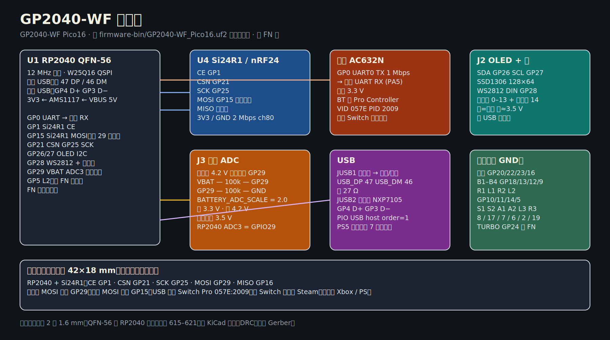
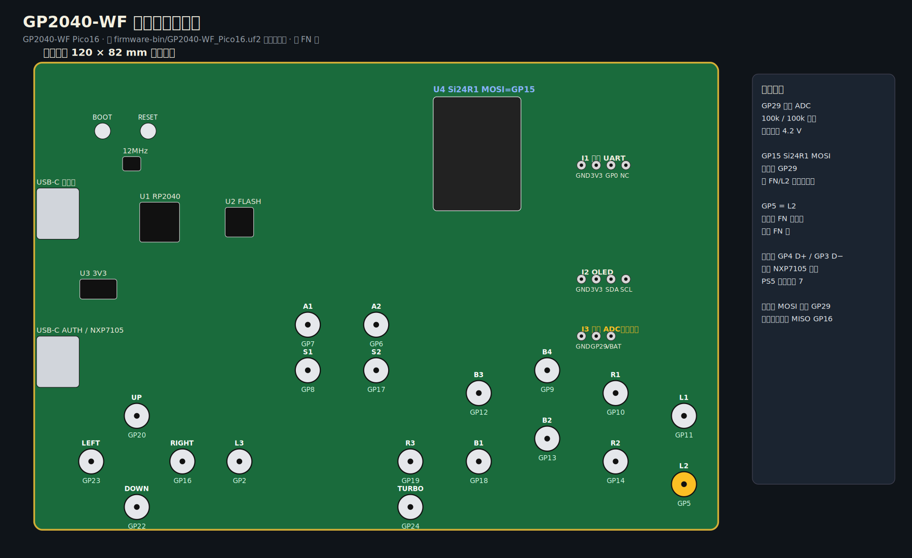
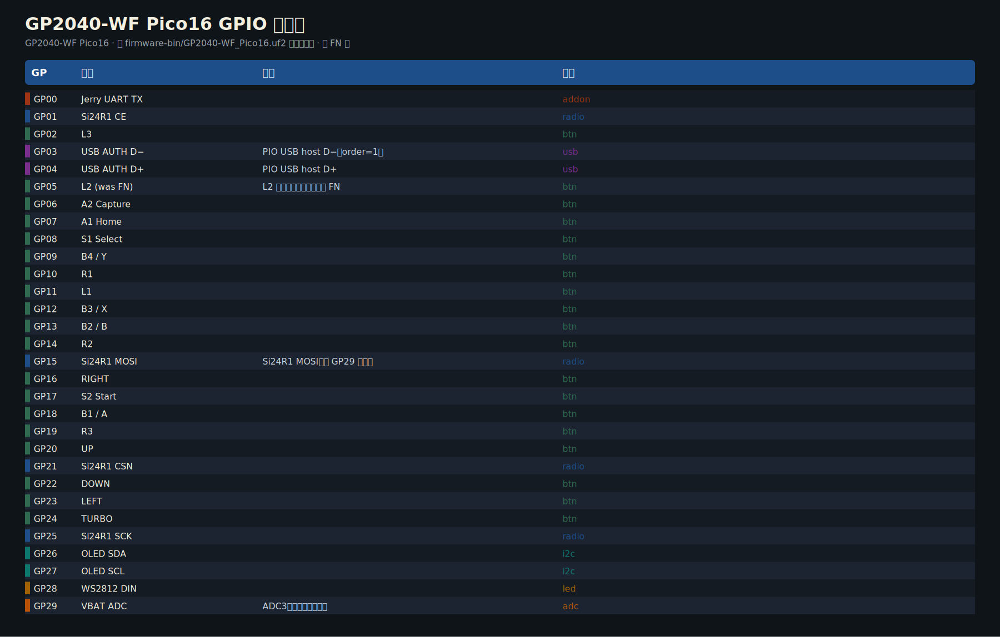
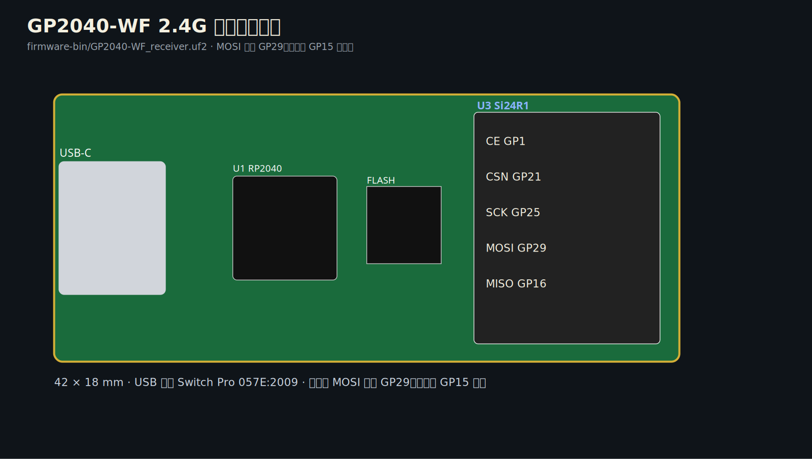

# GP2040-WF

GP2040-CE **原样**跑在 RP2040 上：按键、SOCD、热键、网页配置、有线 XInput / Switch / PS 全部不动。外面只加两条无线。

| 模式 | 谁干活 |
|------|--------|
| **有线 Xbox One / PS5** | 手柄 USB。认证走 GP2040-CE 的 **USB 引导认证**（认证口插带 **NXP7105** 的官方/兼容街机手柄或 dongle）。PS5 固定报街机手柄类型 7，不用 DualShock VID/PID。 |
| **有线 PS4** | 手柄 USB。认证密钥已编进固件，不用网页上传 `serial.txt` / `sig.bin` / `key.pem` |
| **有线 Switch** | 手柄 USB。CE 的 Switch / Switch Pro 描述符 |
| **蓝牙 Switch** | UART → 杰里 **AC632N**，按 CE 的 Switch Pro 协议走 **经典蓝牙 HID**（无加密芯片） |
| **2.4G Switch** | Si24R1 → 第二块 Pico 接收器，USB 枚举成 **Switch Pro**（VID `057E` PID `2009`） |

插着手柄 USB 时无线静音。Xbox / PS **不要**走蓝牙或 2.4G，插手柄 USB。

```
按键 ──► RP2040 GP2040-CE ── USB ──► 电脑 / 主机（含 Xbox/PS 引导认证）
                 ├── UART ──► AC632N ── Switch Pro EDR ──► Switch
                 └── Si24R1 ──► Pico 接收器 USB Switch Pro ──► Switch / Steam
```

开机按键和 GP2040-CE 一样（A=B1）：**A Switch Pro · B Xbox 360 · X PS3 · Y PS4 · R1 Xbox One · L1 PS5 · L2 P5 General · R2 键盘**。无线只在 Switch Pro 模式发。PS4 密钥已内置。

## 烧录（现成 UF2）

现成文件在 [`firmware-bin/`](firmware-bin/)：

1. 按住板上 **BOOT**，插 USB，出现 `RPI-RP2` 磁盘
2. 手柄拖 `firmware-bin/GP2040-WF_Pico16.uf2`
3. 2.4G 接收器拖 `firmware-bin/GP2040-WF_receiver.uf2`

详细步骤、开机组合键见 [`firmware-bin/README.md`](firmware-bin/README.md) 和 [`pcb/FLASH.md`](pcb/FLASH.md)。

**杰里 AC632N 必须另烧固件**（UF2 进不去那颗芯片）。现成 `firmware-bin/GP2040-WF_AC632N.ufw`，GitHub Actions 工作流 `Jieli AC632N HID` 也会编。步骤见 [`firmware/jieli_ac632n/README.md`](firmware/jieli_ac632n/README.md)。只用有线 / 2.4G 可以不焊它。

开机：**A Switch Pro · B Xbox 360 · X PS3 · Y PS4 · R1 Xbox One · L1 PS5 · L2 P5 General · R2 键盘**。Xbox One / PS5 走手柄 USB + 认证口（默认打开）；PS4 用内置密钥；无线只在 Switch Pro 模式发。

OLED 右上角显示电量百分比和链路字母，例如 **87%B**：**L** 插线 / **B** 蓝牙 / **G** 2.4G。电量走 **GP29 ADC**（锂电池必须经分压，默认 100k/100k，`BATTERY_ADC_SCALE` 2.0）。按键 WS2812 串后面再多一颗双色灯：正常绿，低于约 3.5 V 红，插 USB 一定绿。

## PCB 图纸

原理图、装配图、GPIO 表都在 [`pcb/`](pcb/) 和 [`pcb/sheets/`](pcb/sheets/)。









| 板 | 尺寸 | Gerber |
|----|------|--------|
| 手柄主板 | 120×82 mm | [`pcb/stick/GP2040-WF-stick-gerber.zip`](pcb/stick/GP2040-WF-stick-gerber.zip) |
| 2.4G 接收器 | 42×18 mm | [`pcb/receiver/GP2040-WF-receiver-gerber.zip`](pcb/receiver/GP2040-WF-receiver-gerber.zip) |

KiCad 8：`pcb/stick/*.kicad_pcb`、`pcb/receiver/*.kicad_pcb`。投产前铺 GND 铜皮、补齐 USB-C、跑 DRC。QFN-56 按 RP2040 数据手册。重新出图：`python3 pcb/generate_pcb.py`。

## 编译

```bash
git submodule update --init --recursive
export PICO_SDK_PATH=/path/to/pico-sdk
GP2040_BOARDCONFIG=Pico16 cmake -B build && cmake --build build
cmake -S firmware/receiver_pico -B firmware/receiver_pico/build && cmake --build firmware/receiver_pico/build
make -C wireless/host_test
```

没有 picotool 时可用 `tools/elf2uf2.py build/*.elf firmware-bin/out.uf2`。

脚位见 [`docs/CHIP_LOCK.md`](docs/CHIP_LOCK.md)。

## 授权

GP2040-CE 版权归 OpenStickCommunity、Jason Skuby 与 sunga2022。三模附加代码 MIT。
